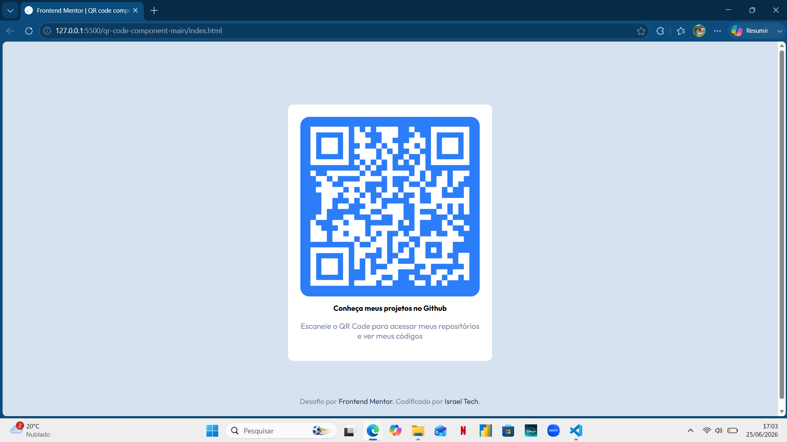
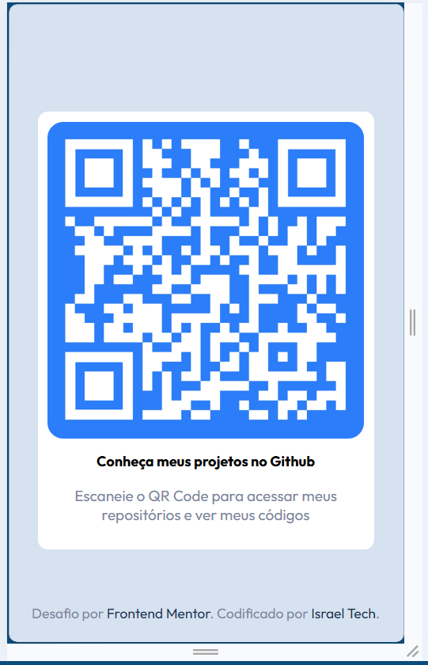

# Frontend Mentor - QR Code component solution

Esta é a minha solução para o desafio [QR code component do Frontend Mentor](https://www.frontendmentor.io/challenges/qr-code-component-iux_sIO_H). Os desafios do Frontend Mentor ajudam desenvolvedores a melhorar suas habilidades de codificação através da construção de projetos realistas.

## Índice

- [Visão Geral](#visão-geral)
  - [O Desafio](#o-desafio)
  - [Links](#links)
- [Meu Processo](#meu-processo)
  - [Tecnologias Utilizadas](#tecnologias-utilizadas)
  - [O que eu aprendi](#o-que-eu-aprendi)
  - [Desenvolvimento Contínuo](#desenvolvimento-contínuo)
- [Autor](#autor)
- [Screenshot] (#Screenshot)

## Visão Geral

### O Desafio

Os usuários devem ser capazes de:

- Visualizar o layout centralizado perfeitamente na tela.
- Visualizar o design de forma fluida dependendo do tamanho da tela do dispositivo (responsividade garantida entre Mobile 375px e Desktop 1440px).
- Escanear um QR Code real, personalizado nas cores do projeto, que redireciona para o meu portfólio.

### Links

- URL do Site ao vivo: [Substitua pela URL do site hospedado (ex: GitHub Pages ou Vercel)]

## Meu Processo

### Tecnologias Utilizadas

- HTML5 Semântico
- CSS3 (Cores em HSL e Tipografia 'Outfit')
- Flexbox (Alinhamento central estrutural)
- Posicionamento Absoluto
- Abordagem Mobile-First
- Media Queries (Adaptação responsiva para telas acima de 768px)

### O que eu aprendi

Neste projeto, consolidei meus conhecimentos sobre a estrutura fundamental de componentes web e layout responsivo. Algumas das principais técnicas aplicadas incluem:

1. *Flexbox Centralizado:* Utilizei display: flex, justify-content: center e align-items: center no body com min-height: 100vh para garantir que o cartão (.qr-card) ficasse perfeitamente no centro da tela.
2. *Responsividade Fluida (Mobile-First):* O layout padrão foi estruturado focado no mobile, garantindo um respiro lateral (padding: 0 20px no body) e controle de expansão usando width: 100% e max-width: 320px.
3. *Media Queries:* Para telas maiores (tablets e monitores a partir de 768px), aumentei sutilmente a área interna do cartão e ajustei o layout para garantir a melhor legibilidade.

css
/* Adaptação para telas maiores */
@media (min-width: 768px) {
    .qr-card {
        max-width: 350px;
        padding: 24px;    
    }
}

4. *Controle de Links e Posicionamento:* O rodapé da Israel Tech foi fixado na parte inferior usando position: absolute. Apliquei técnicas avançadas para resetar os estilos padrão de links visitados (:visited), garantindo a preservação da paleta de cores.

css
/* Preservação de cor do link visitado e transição suave */
.attribution a,
.attribution a:visited {
    color: hsl(218, 44%, 22%);
    text-decoration: none;
    transition: 0.3s;
}

.attribution a:hover {
    text-decoration: underline;
}

### Desenvolvimento Contínuo

Pretendo continuar avançando nos fundamentos do CSS moderno, aprofundando os estudos em CSS Grid para layouts complexos, além de refinar a precisão e a qualidade de componentes de interface de usuário (UI).

## Autor

- Desenvolvido por - *Israel Tech*
- GitHub - [(https://github.com/Rael-developer)]

### Screenshot
### Versão Desktop

### Versão Mobile
